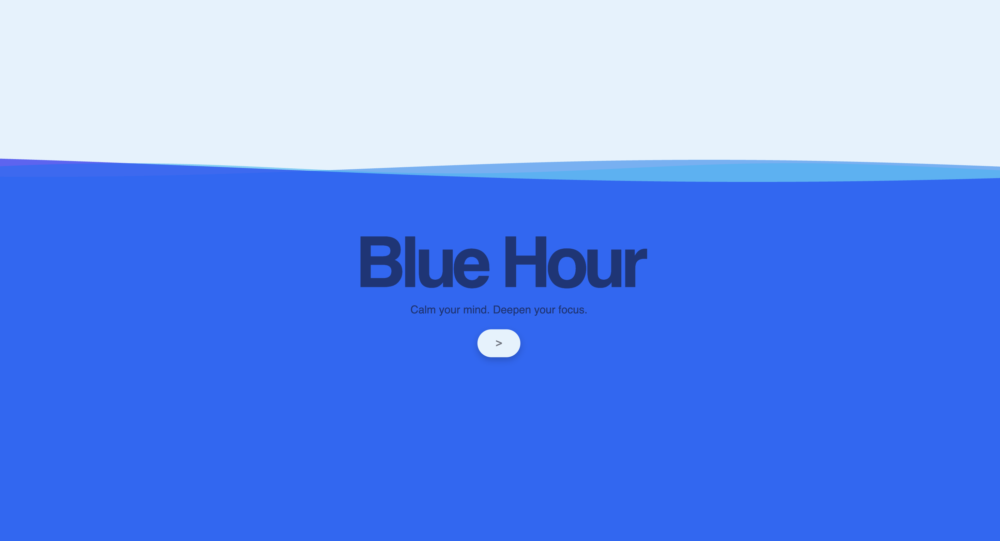
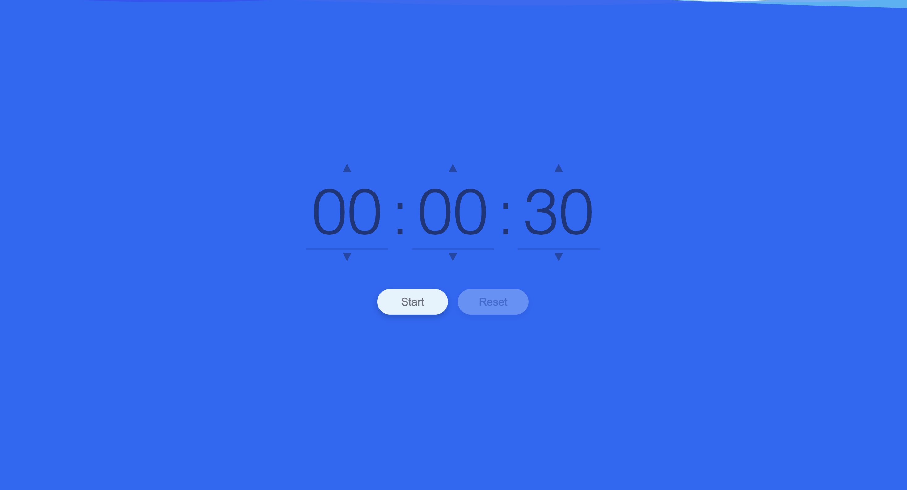
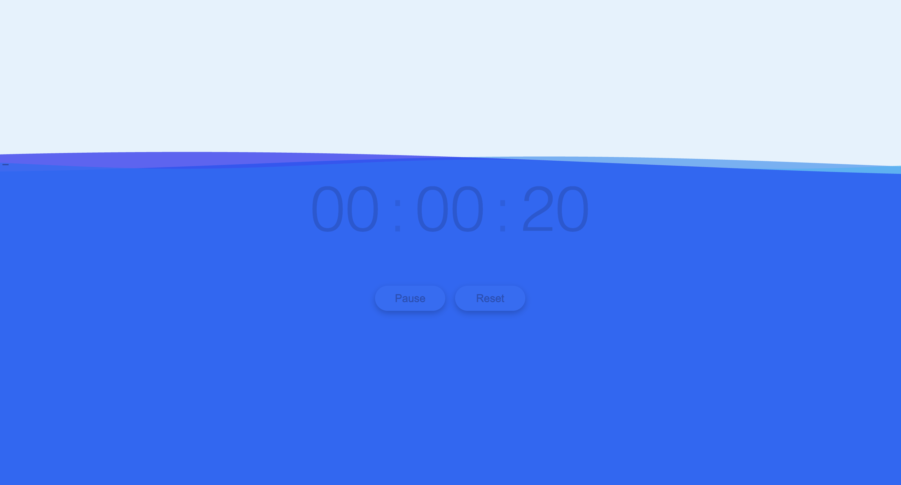

# Blue Hour 🌊
A minimalist, relaxing visual timer where water drains to show time passing.

Blue Hour is a calming timer web app designed to help you focus. 
Instead of pure numbers or harsh alarms, it shows a visual of water slowly draining 
to represent time passing — great for studying, working, or mindfulness sessions.

## Features
- Animated water draining visual
- Custom timer duration
- Smooth transitions between screens

## Demo
Try it live: [https://albertlwang.github.io/blue-hour/]

## Getting Started
1. Clone the repo:
2. Open `index.html` in your browser — no build step required.

## Built With
- HTML
- CSS (animations, transitions)
- Vanilla JavaScript

## Future Improvements
- Sound or haptic feedback options
- Dark mode
- UI upgrades for seamlessness and unobtrusiveness

## License
This is a personal project — feel free to fork or adapt it for your own use.

## Credits
- Wave animation is from user OSUblake, from this GSAP forum: https://gsap.com/community/forums/topic/16172-svg-wave-animation/

